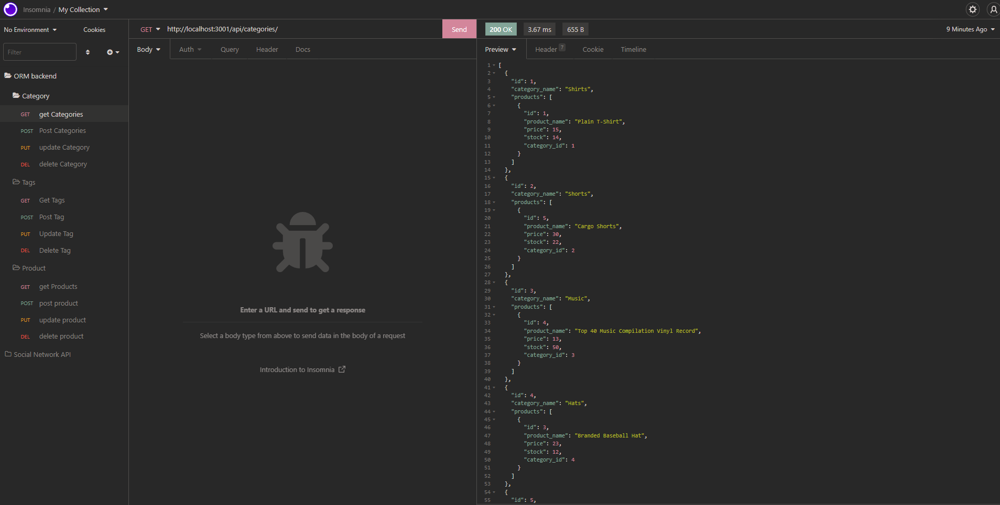
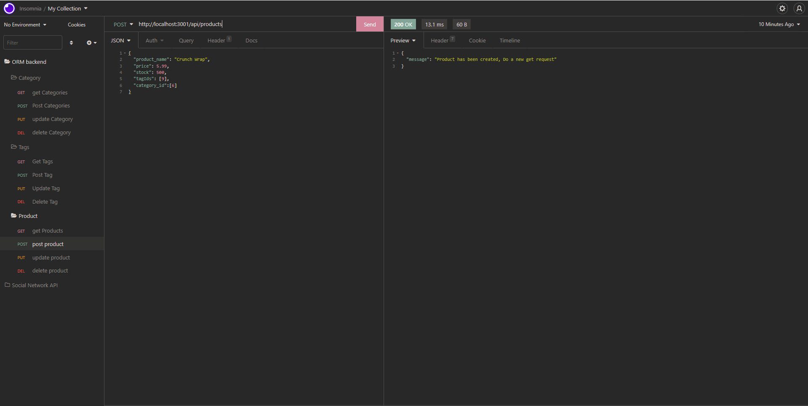

# ORM-E-Commerce-Back-End-Adam-Cleland

### Description

We are tasked to build the back end for an e-commerce site by modifying starter code that has been provided by the Ohio State Full Stack Coding Boot Camp. This application will be utilizing a working express.js API along with using Sequelize in order to interact with the MySQL database.

This application allows the user to make all of the crud command to the database and interact with it by adding, deleting, updating, and viewing all of the information that is saved inside of it.

## Table of contents

---

- **Installation Instructions**
- **Usage Information**
- **Screenshots**
- **Video**
- **Contributions**
- **Questions**
- **License**

## Installation

---

Download the Repo and Run on your local machine

## Usage Information

---

TCreate a .env file with your MySQL information on it that matches the replacements in the config folder.
seed the database by running `npm run seed`
do `npm start` to begin the application.

Use a PWA like insomnia that will allow you to make requests to the locally hosted server (see attached video for further guidance).

## ScreenShots

---

https://drive.google.com/file/d/1BUHzRxkYNtPgcLWIQvlfdgthLwKPit2g/view

## Video

---

Walkthrough Video : [CLICKME](https://drive.google.com/file/d/1BUHzRxkYNtPgcLWIQvlfdgthLwKPit2g/view)

## Contributions

---

Pull requests are welcome. For major changes, please open an issue first to discuss what you would like to change.

## Questions

---

### For Any Questions about the Application feel free to reach out to me on:

Github: [aclelandx](https://github.com/aclelandx)

Email: <aClelandx@gmail.com>

## License

---

Copyright [2022] [Adam Cleland]

        Permission is hereby granted, free of charge, to any person obtaining a copy of this software and associated documentation files (the "Software"), to deal in the Software without restriction, including without limitation the rights to use, copy, modify, merge, publish, distribute, sublicense, and/or sell copies of the Software, and to permit persons to whom the Software is furnished to do so, subject to the following conditions:

        The above copyright notice and this permission notice shall be included in all copies or substantial portions of the Software.

        THE SOFTWARE IS PROVIDED "AS IS", WITHOUT WARRANTY OF ANY KIND, EXPRESS OR IMPLIED, INCLUDING BUT NOT LIMITED TO THE WARRANTIES OF MERCHANTABILITY, FITNESS FOR A PARTICULAR PURPOSE AND NONINFRINGEMENT. IN NO EVENT SHALL THE AUTHORS OR COPYRIGHT HOLDERS BE LIABLE FOR ANY CLAIM, DAMAGES OR OTHER LIABILITY, WHETHER IN AN ACTION OF CONTRACT, TORT OR OTHERWISE, ARISING FROM, OUT OF OR IN CONNECTION WITH THE SOFTWARE OR THE USE OR OTHER DEALINGS IN THE SOFTWARE.
